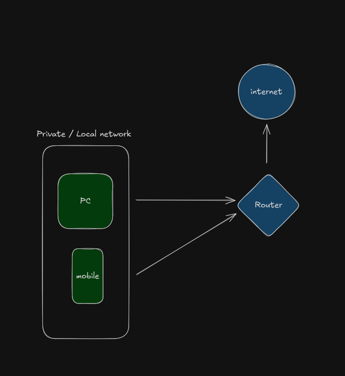

# Over of Network Functionality

## IPv4 and IPv6
IPv4 is a 32 bit value divided up into four octets (for a total of 32 bits). The smallest value is 0 and largest value of each octet is 255 and can be written in binary.

IPv6 is a 128 bit value divided up into sixteen sections of hex values (for a total of 128 bits).

## Difference between private IP and public IP.
The simplest difference is that public IP's are visible to everyone and identifiable on the internet whereas a private IP address is only visible within a private network.
Your public IP address is assigned by the ISP provider  which the public IP address is what connects to the internet.

